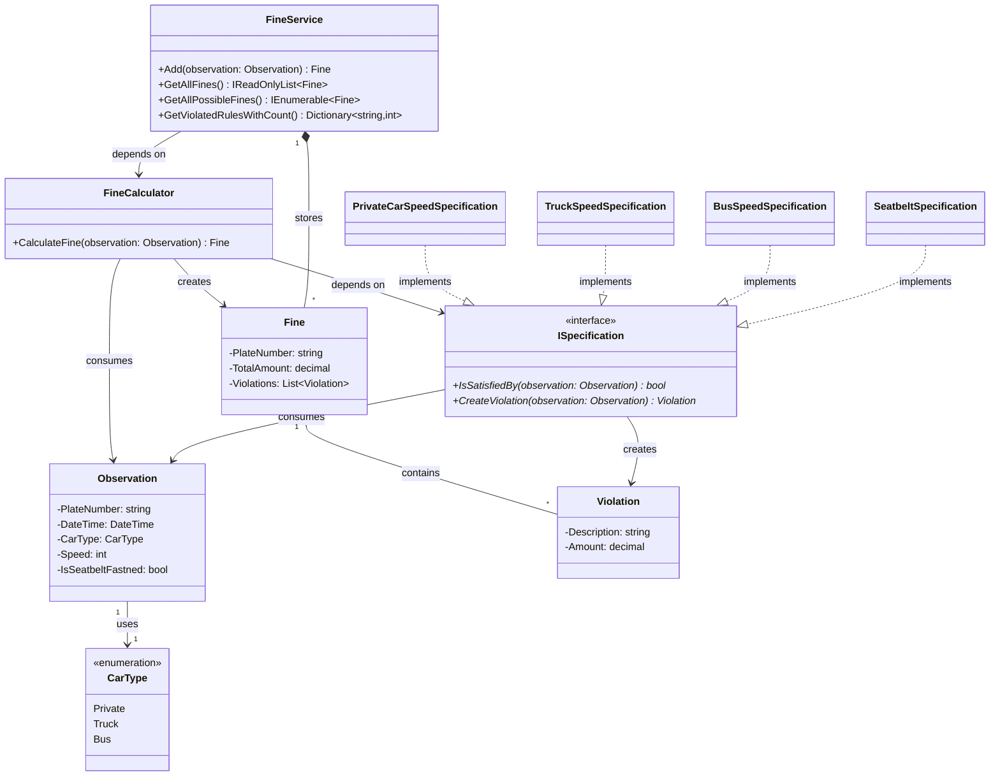

# Fawry-Radar-System

A simple traffic fine management system that processes observations received from physical road radars and generates traffic fines based on predefined business rules.

The project focuses on applying Object-Oriented Programming (OOP), SOLID principles, and clean code practices while keeping the implementation simple and extensible.

---

# Design Principles

This solution was designed based on the following principles:

- Single Responsibility Principle (SRP)
- Open-Closed Principle (OCP)
- Specification Pattern

---

# Task Summary

The system receives observations from a physical traffic radar.

Each observation contains:

- Plate Number
- Date
- Car Type
- Vehicle Speed
- Seatbelt Status

The system evaluates each observation against a set of traffic rules.

If one or more rules are violated, the system generates a traffic fine containing:

- Vehicle Plate Number
- Total Fine Amount
- List of Violations

The system also supports:

- Processing new observations
- Retrieving all generated fines
- Listing all possible fines
- Counting how many times each traffic rule has been violated

---

# Class Diagram



---

# Why Single Responsibility Principle?

Every class has **one reason to change**.

For example:

- **Domain Models** are only responsible for representing data.
- **Specifications** are only responsible for validating business rules.
- **FineCalculator** is responsible for calculating fines.
- **FineService** manages generated fines and provides querying operations.

This separation keeps responsibilities clear and makes the codebase easier to maintain and extend.

---

# Why Specification Pattern?

While reading the requirements, one important statement stood out:

> Traffic rules may increase over time.

A straightforward implementation using multiple `if` / `else if` statements would tightly couple all business rules together.

```csharp
if (...)
{
    ...
}
else if (...)
{
    ...
}
else if (...)
{
    ...
}
```


This approach violates the Open-Closed Principle, because every new traffic rule requires modifying existing logic.
Initially, I considered creating an interface and implementing different rule classes. However, I realized I would still end up writing conditional logic such as:

```csharp
if (specification is SpeedSpecification)
{
    // Create speed violation
}
else if (specification is SeatbeltSpecification)
{
    // Create seatbelt violation
}
```

Although the validation logic was separated, the system still depended on type checking whenever a new rule was introduced.

The Specification Pattern provided a much cleaner solution.

Each traffic rule became an independent specification responsible for:

Checking whether the observation violates the rule.
Creating the corresponding violation when the rule is satisfied.

As a result:

Adding a new traffic rule only requires creating a new Specification class.
Existing business logic remains unchanged.
The system naturally follows the Open-Closed Principle.

# Design Decision: Dependency Inversion Principle

One design decision worth mentioning is the relationship between FineService and FineCalculator.

Currently, FineService depends directly on the concrete FineCalculator implementation.

From a strict SOLID perspective, this creates tight coupling between the two classes. If the calculator implementation changes significantly, FineService would also need to change. The Dependency Inversion Principle (DIP) suggests introducing an abstraction (for example, an IFineCalculator interface) so that high-level modules depend on abstractions rather than concrete implementations.

However, I intentionally decided not to introduce that abstraction.

The reason is simple: there is currently no requirement that justifies it.

The assignment describes only one fine calculation strategy, and there is no indication that multiple implementations or interchangeable calculators are expected.

Introducing an interface in this scenario would increase the number of abstractions without providing any practical benefit. In my opinion, that would be an example of over-engineering.

One of the most important software engineering skills is knowing when to introduce an abstraction and when to keep the design simple.

If future requirements introduce multiple calculation strategies or different fine calculation policies, introducing IFineCalculator would become a reasonable refactoring. Until then, keeping the implementation straightforward results in a cleaner and more maintainable solution.

Design is about balancing flexibility and simplicity. Not every dependency should be abstracted from day one.

---

# Resources

The following resources helped me while designing and implementing this solution:

## Specification Pattern

- My own implementation and notes on the Specification Pattern:
- **Specification Pattern Demo** — [https://github.com/Muhvmd8/SpecificationPatternDemo](https://github.com/Muhvmd8/SpecificationPatternDemo)

## SOLID Principles

- Robert C. Martin (Uncle Bob) - SOLID Principles
- Microsoft Learn – Design patterns and architecture guidance
- Martin Fowler – Enterprise Application Architecture

## UML

- Mermaid Class Diagram Documentation
  - https://mermaid.js.org/syntax/classDiagram.html
